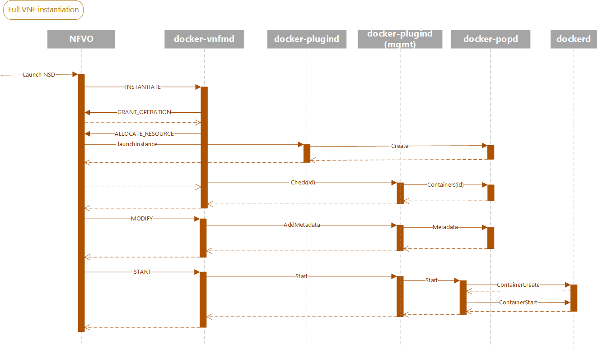

openbaton-docker: overview
==========================

# Why?
openbaton-docker strives to be a viable alternative to Openstack for OpenBaton.

# How? 
openbaton-docker attempts to fully abstract the differences between Docker containers and the ETSI NFV model.
This is implemented using a custom protocol **Pop** _(point of presence)_, to completely hide from the the NFV world how Docker works; the plugin, the NFVO, the VNFM
have no knowledge of the fact they are using Docker, they only know and work on Pop containers.

# OpenBaton <-> Docker mapping issues

Docker (and OCI containers) represents a single service/component that :
* does not hold state
* can be recreated in any moment
* can be torn down in seconds, and brought back up
* completely contains its files and dependencies
* after being created, their configuration cannot be usually changed (ie, there is no way to set new environment variables)
* while they can be attached to networks, usually the IP allocation is either at startup of the container (if left to the daemon), or manual using the --ip parameter

Openbaton treats its Servers and VNFCs as virtual machines:
* Expects them to be modifiable after creation (i.e. to set environment variables)
* Assumes it has the responsability to configure them using scripts (to install and update software)
* Expects them to have well defined IPs after CREATE, to configure other VNFs before START 

# Pop protocol

Pop is a protocol that abstracts a container platform, defined in `pop.proto` using Protocol Buffers, and implented with gRPC.

Pop defines 4 entities:

* Containers
* Images
* Networks
* Flavours 

## Flavours
Flavours are identified by an ID and a Name. They have no particular purpose at the moment.

## Images 
Each Image represents a base image for a Container. The image is expected to contain a pre-packaged copy of a VNFC, ready to be launched;
the image specifies which command will be executed at container startup.

## Networks 
Each Network represents a network meant be used for containers. Each network is identified by an ID, a name and a list of subnets.
A network can either be internal or external. Internal networks should not be reachable from the outside. Pop defines a standard, default "private" network 
to which endpoint-less containers are automatically attached. 

Network creation/deletion is still unimplemented (but pretty trivial to do).

## Containers
Each Container represents a full instance of an Image, connected to one or multiple networks. 
A container obtains its IPs from the networks it is connected to (either automatically or manually through client-side specification), and has an additional
`Metadata` system to store key-value configuration parameters. 

### Container lifecycle
1. A Pop `Container` is created following a `Create` request. The newly created Container is in a **CREATED** state, and all of the specified endpoints are allocated
and attached to it.
2. A Pop `Container`'s `Metadata` can be modified between its creation and its startup; each key-value pair represents a new environment variable to be exposed to the 
underlying image in the container.
3. A Pop `Container` is started (**RUNNING** state) with `Start`, and becomes reachable at its preallocated IPs on the specified endpoints. 
4. A Pop `Container` can be put in the **STOPPED** state with `Stop`, releasing its computational resources and its state. Any IP remains associated to a stopped instance.
5. A Pop `Container` can be deleted, and every trace of it is removed from the system.
6. A Pop `Container` can crash or fail to start; in that case, it goes into the **FAILED** state.

State changes are one-direction only; FAILED and STOPPED containers can only be deleted.

## docker-popd, the Docker Pop server daemon

`docker-popd` implements a Pop server and uses Docker containers as its backend.
More specifically, docker-popd completely abstracts Docker to its clients; the only thing the client knows about are
Pop components.

### Configuration
popd configuration specifies options such as user:password pairs, a TLS key and a certificate to serve on a secure channel (optional), and the URL of the 
Docker daemon to connect to. Passwords in the config file are hashed with bcrypt to avoid putting them into it as clear text.

### Authentication
Authentication is mandatory to access every popd route. `Login` generates a random token, that needs to be set along with other metadata during every pop request.
At the moment, every user has full access; there are no limitations. `Logout` invalidates the token used to authenticate its caller.

### popd mappings 
The pop/server package takes care of handling every request it receives (list, container lifecycle, ...) and maps Docker concepts to Pop concepts.

#### Flavours
popd only specifies a `docker.container` flavour.

#### Networks
When started, docker-popd tries to identify a network named "private" within the specified Docker daemon; if no such network is detected, 
popd detects a free /16 in the reserved 172.16.0.0/12 range among those unused by other Docker networks, and creates it.
In case the network is found, its gateway and its taken addresses are marked as reserved, and are automatically avoided during IP allocation.
Each time a container is created with an endpoint on a given network, popd allocates a free IP from the network; this IP will be reserved, and it's given back
to the network after a container is deleted.
Popd networks match 1:1 with Docker networks.

#### Images
The images that popd exposes are mirrored with the images known to dockerd. Pop image names match Docker image tags.

#### Containers

* A `Create` request creates a container using the parameters specified; the specified Endpoint IPs are allocated.
* A `Metadata` request sets the metadata for the container; old metadata is merged with the new one, but new matching keys discard old ones. Empty keys delete their entry:
`container["id"].md == {"A": "b"}` -> `Metadata(id, {"A": ""})` -> `container["id"].md == {}`
* A `Start` request starts a Pop container; a new Docker container is created with the IPs and env vars of its parent Pop container.
The internal representation of the Pop container is updated with the ID of the Docker container; this will be used to stop it or by the background refresh routine to 
synchronise the state of the Pop container in case its Docker container has crashed/closed.
* A `Stop` request stops the Pop container; the underlying Docker container is stopped and deleted.
* A `Delete` request deletes the Pop container from the daemon. If it is in the RUNNING state, it is stopped first, and then deleted.

## pop/client 

The pop/client package wraps the protoc-generated gRPC Pop client, converting Pop types into go-openbaton catalogue types.
client.Client allows to query and operate on a Pop, getting Openbaton types as a result.

client.Client instances can be created with no cost; connections are created on demand and kept by the library in a pool, reusing the same gRPC connection for the same credentials.
This allows the plugin to use the library in a stateless fashion, without having to reconnect for each operation.

### docker-pop 

`docker-pop` is a CLI tool to query and interface with docker-popd.

## Why does Pop use gRPC instead of AMQP?
* gRPC is much simpler than AMQP to do RPC. It provides a full framework with auto reconnection and a strong-typed serialisation format whose parser is 
automatically generated; the protocol can be extendend and changed very quickly, without fearing to break everything
* AMQP would have made anything much more complex (Qos? Ack? gRPC handles all of this at no cost)
* pop is clearly an RPC oriented solution; there's no need for topics and such
* popd is fully self contained, decoupled, and standalone. It depends on no openbaton component, and neither it knows anything about openbaton. 
* Authentication with RPC with AMQP? gRPC metadata makes it trival and much more "OpenStack" like

# mgmt

## Why mgmt
* The VNFM needs to modify and start VNFC Instances in its Modify and Start request handlers
* But the VNFM only has access to Vim credentials during the Instantiate request
* Keeping any data in the VNFM is highly undesiderable (the VNFM is stateless)
* Generic VNFM uses AMQP + EMS to connect to VNFs
* The VNFM already uses AMQP to communicate with the NFVO
* The plugin is on the same bus, and has already a connection with docker-popd
* mgmt minimises exposure of docker-popd: only a few commands are available via mgmt, and the manager can be closed when not needed (ie, 0 servers)

## What mgmt does
mgmt is a library that allows the VNFM to instantiate a limited set of operation towards a Pop instance.
mgmt supports only Check (to check if a VNFC is up), Start and Metadata operations; each time a LaunchInstance(AndWait) is executed by the plugin,
a mgmt Manager instance is spawned (as a routine inside the plugin) to handle incoming AMQP requests.
When the VNFM handles an Instantiate, Start or Modify operation, it uses the mgmt client to send a request to Check a VNFC, to Start it or to set some metadata
using the id of its VimInstance to identify the right queue; the Manager will use the Pop client of the associated instance to accomplish the request.
This makes the VNFM totally independent from Pop: only the plugin knows about it, and communicates with it.

mgmt piggybacks on the underlying VNFM or Plugin AMQP connection to get an AMQP channel, so it's 100% configuration free.

# Example: Instantiation of a VNF

# Possible developments
* Support network creation (should be trivial)
* Support scaling in VNFM
* Abstract images (ie, list to the clients all of the VNF Docker images available on the Hub, and then pull them on demand?)
* ...